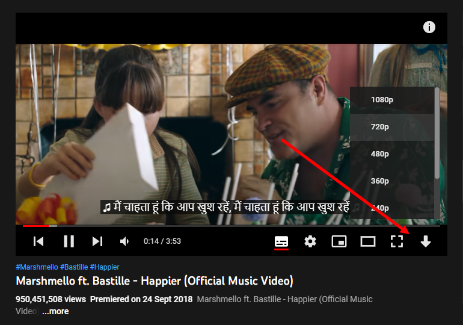
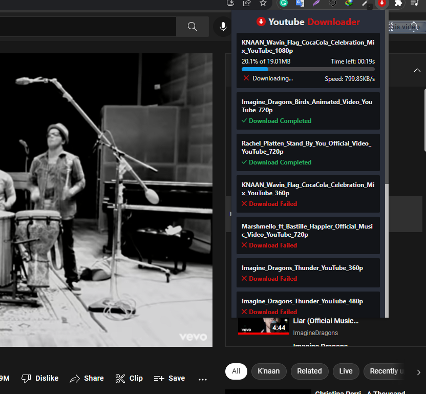

  

<h1 align="center"> Next Downloader</h1>

  <b >It's a NodeJs app and a browser extension to download youtube videos</b>

 

## Description
Download youtube videos without any problem and It's pretty simple. It uses [ytdlp](https://github.com/yt-dlp/yt-dlp) for downloading videos, [FFmpeg](https://ffmpeg.org) to merge audio & video, and a browser extension used to communicate with the browser.

Features:

* You can download youtube in any format.
* You can download multiple videos. It will download one by one.

Next features:

* Download entire playlist with a single click.

### Extension Installation
Chrome:
* Clone the repository.
* Build your custom extension from `chrome://extensions/` by Load Unpacked this repo after switching to developer mode.
* Done... Now enjoy youtube video without ads.

Firefox:<a href="https://addons.mozilla.org/en-US/firefox/addon/next-downloader/">
Get it to firefox addons store
</a>
### Windows Application
<a href="https://nextdownloader.web.app/">
Get it to Website 
</a>
|
<a href="https://github.com/iqbal-rashed/next-downloader">
Visit Repo
</a>

## ScreenShots

 

## Contribution
If you want to contribute or report any bug, you welcome

Don't forget to give a star 😍

